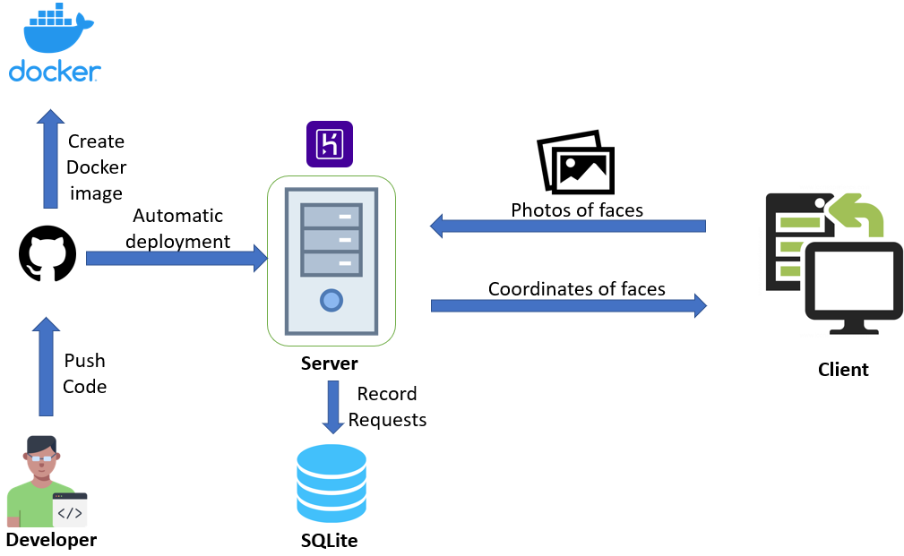

# ComputerVisionRestAPI

## Project Overview
`ComputerVisionRestAPI` is a Python project allowing users to identify coordinates of rectangular boxes localizing faces. Users can send an HTTP POST request with an image attached to this server, and receive a list of these rectangles' coordinates. In addition, this project also includes a Client program to make it easier for users to send the image without the hassle of coding.

## Components:



This project includes below components:
- A REST API Server written in Python using Flask framework
- A REST API Client to send the HTTP POST request to the server
- A built-in SQLite database to record the requests sent
- Heroku integration to showcase the server
- A Docker image

## Dependencies:

- For the Server, please run the below command to install dependencies from [ComputerVisionServer.yml](ComputerVisionServer.yml):
```bash
$ conda env create -f ComputerVisionServer.yml
```

- For the Client, please run the below command to install dependencies from [ComputerVisionClient.yml](ComputerVisionClient.yml):
```bash
$ conda env create -f ComputerVisionClient.yml
```

## Server commands:

- Start the server:
```bash
$ export FLASK_APP=src/app.py
$ python -m flask run
```

- Go to the home page (port 80) to see the list of requests. If running the server in development environment, please change the port from 80 to 5000.

## Client commands:

```bash
$ python src/client.py --api='http://<your_host>:80/recognizeFace' --img_path=<your_path_to_image>
```

- If running the server in development environment, please change the port from 80 to 5000.

## Heroku Integration:

Please go to this [Heroku website](https://cv-face-recognition.herokuapp.com/) to see the list of requests sent there. In addition, you can send your http request to this host.

## Docker image

Please go to this [Docker website](https://hub.docker.com/r/tdkhanhvu/cv-face-recognition) to pull a Docker image of this project.

## Future Improvements

Due to the time constraint, I have chosen the lightweight frameworks / components to build this project. As a result, below are the few considerations to further enhance the performance and security of this project:

**1. Replace the web framework**

Some of Flask's drawbacks are: unsuitable for big applications, no admin site, potentially challenging migration... Therefore, we can consider other full-fledged frameworks such as Django to substitute Flask.

**2. Replace the database**

SQLite can only handle low to medium traffic HTTP requests, and its database size is restricted to 2GB in most cases. Hence, we can contemplate switching to other powerful Databases such as MySQL or PostgreSQL if there is an increase in demand for this service.

**3. Develop a separate portal to display requests**

We should introduce a separate web page with authentication to display requests sent to this website.

**4. Replace the Pillow library used**

I used the Pillow library to convert data sent to the server into an image. Nevertheless, I had some trouble trying to package this project into a Docker image. It took me a few hours to troubleshoot this problem, and fortunately, I managed to find a sample Dockerfile on a Github repository listing the necessary dependencies to build Pillow. Hence, I also need to split the `requirements.txt` into a separate file for Docker to move Pillow installation itself to Dockerfile.

The same problem did not occur when installing using Conda locally or Pip on Heroku web page.

**5. Reduce the size of the Docker image and optimize the Dockerfile**

Due to the problem in point 4 above, I had to list quite a number of dependencies and this probably led to a huge Docker image of 1GB despite the simplicity of this project. Further work can be done to trim down this Docker image.

**6. Record more details from the HTTP POST request**

The application is only recording the IP address of clients and the time the request was received. We can explore other useful information to record such as the size of the image, how many faces were detected...

**7. Adding more unit tests to increase code coverage**

I only test the main function `recognize_face` and a few other database operations due to time constraint. More tests should be added to thoroughly test all parts of this project.

**8. Introduce other features to analyze the pictures sent**

For now, I only focus on finding the rectangle surrounding the face. However, we can introduce other Rest API Endpoints such as to detect the remaining items in the background, or predict the gender, age, race... of the person.

## Contributors

We welcome and recognize all contributions. You can see a list of current contributors in the [contributors tab](https://github.com/tdkhanhvu/ComputerVisionRestAPI/graphs/contributors).

- Tran Doan Khanh Vu